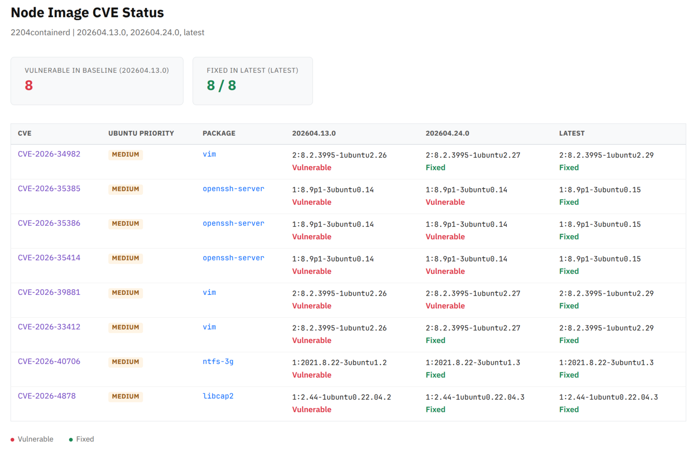

# AKS Ubuntu Node CVE Checker

Scan AKS Ubuntu Node images CVE status with OSV API.

## Download the script & run

```bash
curl -O https://raw.githubusercontent.com/m8yng/aks-troubleshooters/main/aks-node-image-cve-checker/aks-node-image-cve-checker.py
pip install requests
python3 ./aks-node-image-cve-checker.py
```

### Run in Docker

```bash
docker run --rm python:3.14-slim-trixie bash -c "
  apt update -qq && apt install -y -qq curl > /dev/null 2>&1 && \
  curl -sO https://raw.githubusercontent.com/m8yng/aks-troubleshooters/main/aks-node-image-cve-checker/aks-node-image-cve-checker.py && \
  pip install -q requests && \
  python3 ./aks-node-image-cve-checker.py --cve-list 'CVE-2026-35385,CVE-2026-35386,CVE-2026-40706,CVE-2026-4878' -t 2204containerd --compare 202604.13.0,202604.24.0,latest
"
```

## Examples

```bash
# Scan latest image
python3 aks-node-image-cve-checker.py -t 2204containerd

# Filter by severity or packages
python3 aks-node-image-cve-checker.py -s medium
python3 aks-node-image-cve-checker.py -p openssl,kernel

# Save report
python3 aks-node-image-cve-checker.py -o report.json
python3 aks-node-image-cve-checker.py -j | jq .

# Compare CVE list across image versions
python3 aks-node-image-cve-checker.py \
  --cve-list "CVE-2026-3497,CVE-2026-35385,CVE-2026-40706" \
  -t 2204containerd \
  --compare 202604.13.0,202604.24.0,latest

# Compare with HTML report output
python3 aks-node-image-cve-checker.py \
  --cve-list cves.txt \
  -t 2204containerd \
  --compare 202604.13.0,latest \
  --html cve_report.html
```

## Options

```
build_log             VHD build log to parse (auto-downloads if omitted)

-o, --output          save JSON report
-j, --json            output as JSON
-p, --package-names   filter packages (comma-separated)
-s, --security-level  minimum severity {critical,high,medium,low,negligible}
-t, --type            image type (default: 2404containerd)
-i, --image-version   specific image version
-r, --refresh         refresh cache
--cve-list            comma-separated CVE IDs or path to plaintext file
--compare             comma-separated image versions to compare (first=baseline)
--html                output HTML report (used with --compare)
```

## CVE Comparison Report



Use `--cve-list` with `--compare` to check specific CVEs across multiple image versions:

- First version in `--compare` is the **baseline**
- Only CVEs **vulnerable in baseline** are shown
- Subsequent versions show whether each CVE is fixed or still vulnerable
- Package names and fix versions are resolved automatically via OSV
- `--html` generates a styled report suitable for sharing

The `--cve-list` accepts either:
- Inline: `"CVE-2026-3497,CVE-2026-35385"`
- File: a plaintext file with comma-separated CVE IDs (single line)

## Data Sources

- **Build logs**: [Azure/AgentBaker](https://github.com/Azure/AgentBaker/tree/master/vhdbuilder/release-notes/AKSUbuntu)
- **Vulnerabilities**: [OSV API](https://google.github.io/osv.dev/api/)
- **Severity**: Ubuntu priority (via OSV `severity[type=Ubuntu]`)

## Cache

Results cached in `./script_cache/`. Use `-r` to refresh.

## Limitations

> **Notice:** CVE results only cover packages installed via apt/dpkg. Software installed under `/opt/` or other locations is not checked.
